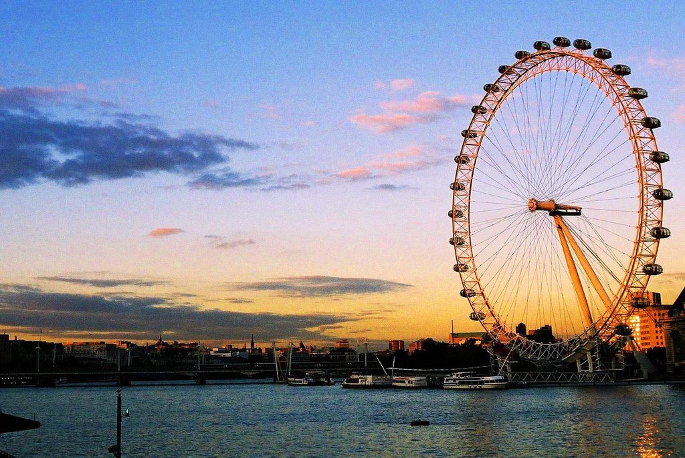
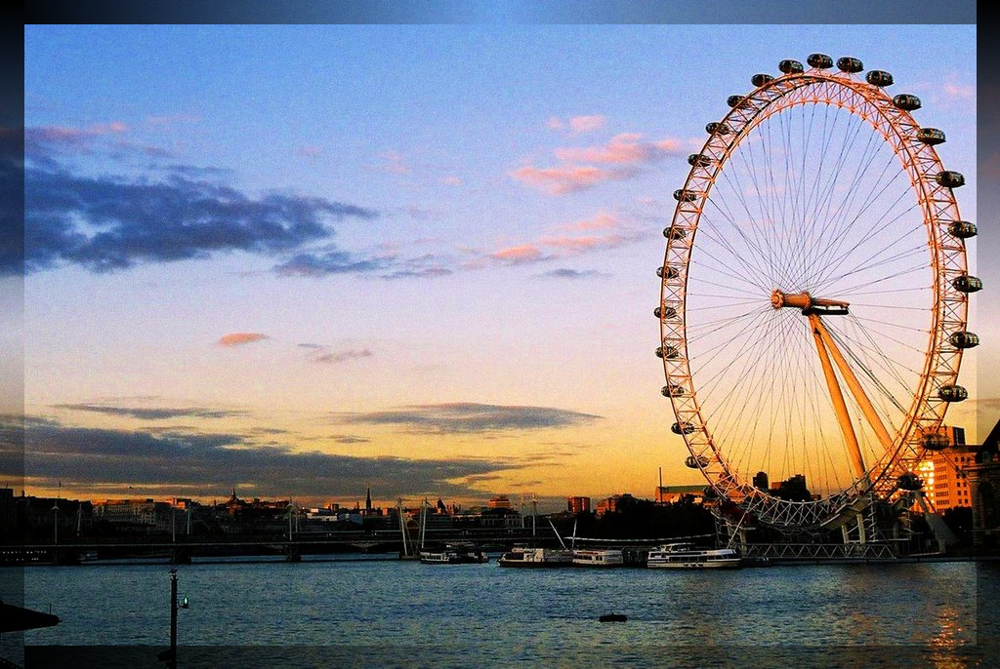

# HW1-Q2-1
* 讀取圖片，利用程式中設定的暗角所佔畫素比例產生暗角。
* 輸出結果圖片。

# Implementation
以之前meeting的專案為基底，pixptr[0] ,pixptr[1] ,pixptr[2]分別代表Blue ,Green ,Red三種顏色，<br/>
分8個部分撰寫，利用for迴圈的 i 和 j 作為 row 和 column 的 count ， p 和 q 則為 i 和 j 分別+1 避免發生除以0的情況，<br/>
左上以及右上以 **p / x**越靠近畫面中間時越接近 **1**使得畫面呈現接近原圖，<br/>
 **p / x**越靠近畫面角落時越接近 **0**使得畫面靠近角落則接近全黑<br/>
其餘 6 個部分也是以相同的觀念做操作，最後顯示出結果圖片。<br/>
```

#include "stdafx.h"
#include <iostream>
#include <opencv2\opencv.hpp>

using namespace cv;
using namespace std;

int main(){

	cv::Mat image;
	image = cv::imread("../image/view.jpg");   // Read the file
	uchar *pixptr;
	if(image.empty()){
		std::cout << "圖片不見了QQ";
		system ("pause");
		return 0;
	}
	int x, y,p,q,r,c,m,n;
	//cout << image.rows<<endl;  //686直
	//cout << image.cols << endl; //1024橫
	x = image.rows / 2;
	y = image.cols / 40;
	m = image.cols / 2;
	r = image.rows-y;	
	c = image.cols-y;
	for(int i=0; i<image.rows; i++){
		pixptr = image.ptr<uchar>(i);
		for(int j=0; j<image.cols; j++){
			if (j < y && i < x){						//左上
				p = i + 1;
				q = j + 1;
				pixptr[0] = pixptr[0] * p / x;
				pixptr[1] = pixptr[1] * p / x;
				pixptr[2] = pixptr[2] * p / x;
				pixptr += 3;
			}
			else if (j > c && i < x){				   //右上
				p = i + 1;
				q = j + 1;
				pixptr[0] = pixptr[0] * p / x ;
				pixptr[1] = pixptr[1] * p / x ;
				pixptr[2] = pixptr[2] * p / x ;
				pixptr += 3;
			}
			else if (j < y && i > x){				  //左下
				p = i + 1;
				q = j + 1;
				pixptr[0] = pixptr[0] * x / p ;
				pixptr[1] = pixptr[1] * x / p;
				pixptr[2] = pixptr[2] * x / p ;
				pixptr += 3;
			}
			else if (j > c && i > x){				  //右下
				p = i + 1;
				q = j + 1;
				pixptr[0] = pixptr[0] * x / p ;
				pixptr[1] = pixptr[1] * x / p ;
				pixptr[2] = pixptr[2] * x / p ;
				pixptr += 3;
			}
			else if (j < m && i > r){				   //下左
				p = i + 1;
				q = j + 1;
				pixptr[0] = pixptr[0] *q / m;
				pixptr[1] = pixptr[1] *q / m;
				pixptr[2] = pixptr[2] *q / m;
				pixptr += 3;
			}
			else if (j < m && i < y){				   //上左
				p = i + 1;
				q = j + 1;
				pixptr[0] = pixptr[0] * q / m;
				pixptr[1] = pixptr[1] * q / m;
				pixptr[2] = pixptr[2] * q / m;
				pixptr += 3;
			}
			else if (j > m && i > r){				   //下右
				p = i + 1;
				q = j + 1;
				pixptr[0] = pixptr[0] * m / q;
				pixptr[1] = pixptr[1] * m / q;
				pixptr[2] = pixptr[2] * m / q;
				pixptr += 3;
			}
			else if (j > m && i <y ){				   //上右
				p = i + 1;
				q = j + 1;
				pixptr[0] = pixptr[0] * m / q;
				pixptr[1] = pixptr[1] * m / q;
				pixptr[2] = pixptr[2] * m / q;
				pixptr += 3;
			}
			else{
				pixptr[0] = pixptr[0] * 1;
				pixptr[1] = pixptr[1] * 1;
				pixptr[2] = pixptr[2] * 1;
				pixptr += 3;
			}
		}
		
	}

	cv::imwrite("../image/Result1.png", image);
	cv::imshow("Traverse result", image);
    cv::waitKey(0);
	return(0);
}
```

# Theory
* 三原色光模式
* 極限定律

# Result
原圖:<br/>
<br/>
暗角顯示出的結果:<br/>
<br/>

# Reference
1.  meeting 的 專案<br/>
2.  暗角參考 http://stackoverflow.com/questions/22654770/creating-vignette-filter-in-opencv
3.  暗角wiki https://en.wikipedia.org/wiki/Vignetting
3.  圖片出處 http://i.imgur.com/Wb4c11s.jpg
